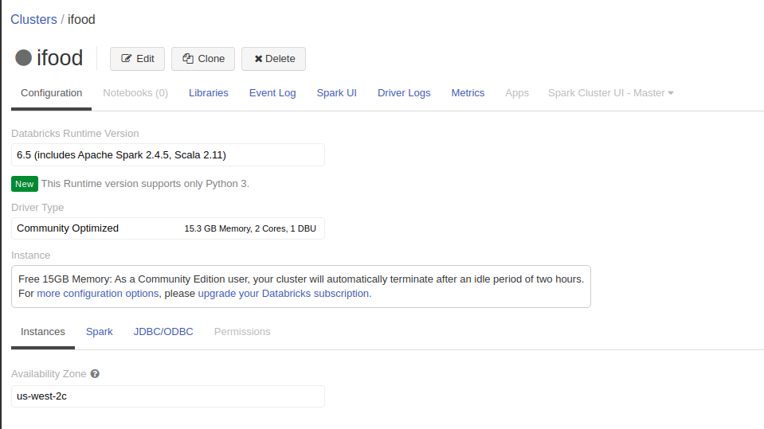

# Comments

## Technologies used

* Due to the high volume of data and challenge requirements, it was chosen to use the Community Databricks platform

* Spark with python 3 and new Databricks features - DeltaLake

* Below follow the information of the cluster used:

### Thanks!

### Marcio de Lima

